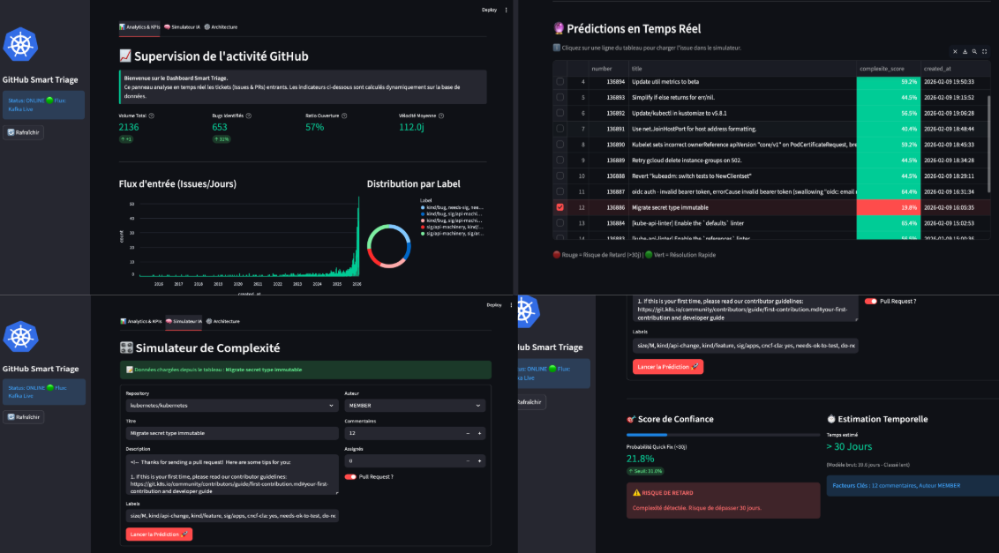
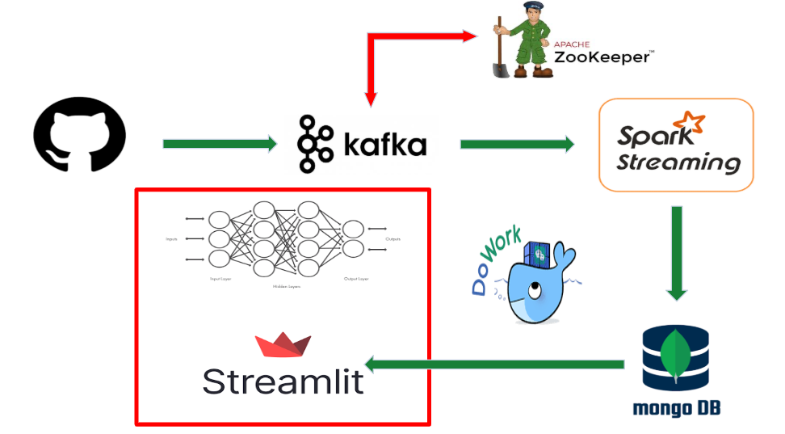
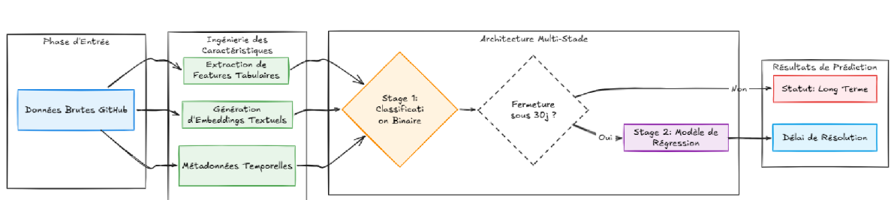

# 🚀 GitHub Smart Triage – Real-Time Issue Resolution Prediction

[](https://spark.apache.org/)
[](https://kafka.apache.org/)
[](https://www.mongodb.com/)
[](https://mlflow.org/)
[](https://www.docker.com/)
[](https://streamlit.io/)

---

# 📌 From Big Data to Smart Decision

> _"My problem isn't the code — it's the noise."_

Large open-source projects receive a continuous stream of GitHub issues.
Some are simple, others may hide long and complex resolution cycles.

## 🎯 Project Goal

Turn a high-volume GitHub issue stream into a **real-time decision-support system** for:
- **Early risk detection** (slow-to-resolve issues)
- **Accurate time-to-resolution estimation** (for likely fast issues)
- **Live monitoring** of activity & predictions

---

# 🚀 What This Project Delivers

- ✅ Real-time ingestion of GitHub issues (GitHub API → Kafka)
- ✅ Stream processing with Spark Structured Streaming
- ✅ Clean + enriched dataset stored in MongoDB
- ✅ Multi-stage ML pipeline (Classification → Regression)
- ✅ Live dashboard (monitoring + prediction simulator)
- ✅ MLflow tracking (experiments, metrics, artifacts)
- ✅ Fully containerized setup (Docker Compose)

---

# 🖥️ Dashboard Overview (Monitoring + Predictions)



The Streamlit dashboard includes:

### 1) GitHub Activity Monitoring
- Global counters (issues volume, bug share, open ratio, average velocity)
- Input flow over time (issues/day)
- Label distribution (top labels)

### 2) Real-Time Predictions Table
- A live table of recent **open** issues (pulled from MongoDB)
- A **risk/complexity score** (Stage 1 probability)
- Color-based prioritization (red = risky / green = quick)
- Click a row to preload the simulator

### 3) Complexity Simulator (Manual Testing)
- Choose a repo, author type, labels, comments, assignees…
- Run prediction on-demand to validate model behavior

### 4) Model Output Panel
- Probability of **quick fix (< 30 days)**
- Predicted resolution time (days) for quick-fix cases

---

# 🏗️ Global Architecture

## 🔹 Big Data & Streaming Architecture



### 🔧 Tech Stack (as implemented)

- **GitHub API (REST)**: issue collection
- **Kafka**: event streaming / buffering
- **Spark Structured Streaming**: parsing, cleaning, enrichment
- **MongoDB**: storage (with indexes; `id` is unique)
- **Streamlit**: monitoring dashboard + inference simulator
- **MLflow**: experiment tracking (file store by default; server available in compose)
- **Docker Compose**: reproducible deployment

Notes:
- `docker-compose.yml` uses Confluent images (`cp-kafka:7.5.0`, `cp-zookeeper:7.5.0`), which correspond to Apache Kafka 3.5.x.
- Spark runs on `bitnamilegacy/spark:3.5.0`.

---

# 🧩 Machine Learning Architecture (Multi-Stage)



## 🎯 Why a Multi-Stage Design?

Predicting the exact number of days directly is hard because the distribution is:
- Highly imbalanced
- Long-tail heavy (very long resolution times)

👉 A **2-stage hybrid pipeline** improves robustness and usability.

---

## 🥇 Stage 1 — Binary Classification (Filter)

### Goal
Predict whether an issue will be closed in **≤ 30 days**.

Target:

```python
resolved_30d = 1  # closed <= 30 days
resolved_30d = 0  # otherwise
```

### 🎯 Usage
- Early filtering of risky issues
- Prioritization for triage workflows

---

## 🥈 Stage 2 — Regression (Estimator)

Trained to estimate the number of days **within the “quick” horizon**.

### Goal
Estimate the (short-horizon) number of days to close an issue.

### 🎯 Usage
- Planning and scheduling
- Short-term estimation with higher precision

---

# 📊 Features

The model uses both:

## 🔹 Tabular Features

- `comments`, `num_assignees`, `labels_count`
- `title_len`, `body_len`, `has_body`
- `created_dow`, `created_hour`

## 🔹 Engineered Features

- Time-to-first-comment features: `ttf_missing`, `ttf_capped_72h`, `ttf_log1p`
- Text/body missingness: `body_missing`
- Label flags: `has_bug`, `has_security`, `has_docs`, `has_feature`, `has_question`, `has_good_first_issue`, `has_help_wanted`
- Repo historical priors (fit on train only):
  - Stage 1: `repo_count_train`, `repo_posrate_train`
  - Stage 2: `repo_count_train`, `repo_median_days_train`

## 🔹 NLP Features

- Sentence embeddings on `(title + body)` using Sentence-Transformers
  - Default model: `sentence-transformers/all-MiniLM-L6-v2`

---

# 🤖 Models Used

- Stage 1: **XGBoost classifier** (with optional calibration)
- Stage 2: **XGBoost regressor**

---

# 📈 Results (From MLflow Runs in This Repo)

These values come from the stored MLflow runs under `mlruns/`.

## 📌 Stage 1 — Classification (Test Set)

| Metric | Value |
|---|---:|
| AUC ROC | 0.66 |
| AUC PR | 0.57 |
| Recall | 0.96 |
| Precision | 0.43 |
| F1-score | 0.60 |

## 📌 Stage 2 — Regression (Test Set)

| Metric | Value |
|---|---:|
| MAE | 4.82 days |
| Median Absolute Error | 1.75 days |
| Accuracy ≤ 7 days | 75.1% |
| Accuracy ≤ 14 days | 89.5% |

---

# 🐳 Services

This project runs with Docker Compose.

| Service | Host Port | Notes |
|---|---:|---|
| Zookeeper | 2181 | Kafka coordination |
| Kafka | 9092 | Host access (`localhost:9092`) |
| MongoDB | 27017 | `github` DB + indexes (unique `id`) |
| Spark Master UI | 8080 | Cluster UI |
| Spark Master | 7077 | Spark master endpoint |
| Spark Driver UI | 4040 | Active job UI (when running) |
| MLflow | 5001 | Exposes container port 5000 on host |
| Streamlit Dashboard | 8501 | Main UI |
| Train Viz | 8502 | Optional dataset audit UI |

Internal networking notes:
- Containers should use Kafka at `kafka:29092`.
- Containers should use MongoDB at `mongodb:27017`.
- Compose exposes Kafka to the host at `localhost:9092`.

---

# 🚀 Quickstart (Docker)

## 1) Requirements

- Docker + Docker Compose
- A GitHub token (recommended to avoid rate limits)

## 2) Configure environment

Create a `.env` file at repo root (Docker Compose auto-loads it):

```bash
cat > .env << 'EOF'
GITHUB_TOKEN=ghp_your_token_here
EOF
```

## 3) Start the infrastructure

```bash
docker compose up -d
docker compose ps
```

## 4) Start the Kafka producer (backfill + live)

The producer sends issues to topic `github.issues.raw`.

```bash
docker compose up -d kafka-producer
```

By default it monitors `kubernetes/kubernetes` every 60 seconds.
You can override in `docker-compose.yml` (env vars: `TARGET_REPO`, `POLL_INTERVAL`).

## 5) Start the Spark streaming job

```bash
./spark/submit.sh
```

Spark reads from Kafka topic `github.issues.raw`, enriches records, and writes to MongoDB (`github.issues`).

## 6) Open the dashboard

- Dashboard: http://localhost:8501
- Spark UI: http://localhost:8080
- MLflow UI: http://localhost:5001

---

# 🔬 Training / MLOps

- Training scripts live under `ml/train/`.
- Job wrappers are under `ml/jobs/`.
- MLflow local file store is `./mlruns/` by default.

If you run training inside containers, use the internal tracking URL:

```bash
export MLFLOW_TRACKING_URI=http://mlflow:5000
```

---

# 🧪 Dataset Audit (Optional)

This repo includes an additional Streamlit app to audit a JSONL dataset:

```bash
docker compose up -d train-viz
```

Then open http://localhost:8502

---

# 🛑 Stop / Cleanup

```bash
docker compose down
```

---

# 👥 Contributors

- Yahya Bahloul
- Zakaria Bougayou